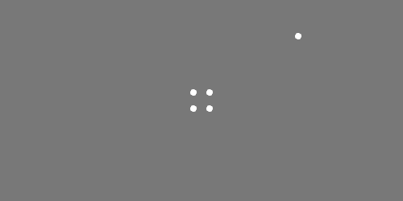

# CS120 Generate Points Image Assignment

For this assignment you will practice writing an indefinite loop, `cin`/`cout`, and using the [doodle framework](https://rudy-digipen.github.io/doodle-release/0.2/index.html).

You are to use the `doodle` framework to produce an image of white points on a grey background. 

The program will first prompt for and read in a width and height for the image _(doodle window size)_. It will create a doodle window of that size and set the background color to the grey scale color **120**. Then it will read in as many 2D integer points as it can. For each point it will draw a **white** circle with a **radius of 4** pixels. When there are no more points provided then it will capture a screen shot of the doodle window and save it out as PNG file `points.png`.

## Example Play Through

#### Step 1

```txt
Enter in desired width: 
```
_user enters 500_

#### Step 2

```txt
Enter in desired width: 500

Enter in desired height: 
```
_user enters 250_

#### Step 4

```txt
Enter in desired width: 500

Enter in desired height: 250

Enter in your points:

```

User enters:
```txt
10 10
-10 10
-10 -10
10 -10
120 80
```
#### Step 5

User is done, so does Ctrl+Z to signal EOF.

The program closes and there is now a `points.png` file that looks like this:



## Test Cases

On the command line, we can provide a text file as a replacement for input. This way, we save time by not having to type in the same input each time we run the program. Let's see how to do that.

Let's assume your executable name is `doodle.exe`.

I'm going to define the `test1.txt` text file with the following contents:

~~~txt
500 250
10 10
-10 10
-10 -10
10 -10
120 80
~~~

Instead of typing in those numbers all the time I will feed this text file to the `doodle.exe` file on the command line using the **<** operator.

```txt
C:\Users\student\assignments>doodle.exe < test1.txt
Enter in desired width:
Enter in desired height:
Enter in your points:
C:\Users\student\assignments>
```

Now when the program uses `cin`, `cin` will read from `test1.txt` instead of the terminal. When it is done reading the file, our program will exit and we should have a `points.png` just like before when we typed this out by hand.

When I have a new `doodle.exe` and I want to test it then I can quickly do **`doodle.exe < test1.txt`** again. No need to repeat typing in all those numbers. :wink:

There are 4 provided test cases and a sample executable that you can use to compare your results with. Use this time saver to verify your results.

To help with comparing images I suggest using the [`P4Merge`](https://www.perforce.com/products/helix-apps/merge-diff-tool-p4merge) tool.

## doodle functions to investigate

* `create_window()`
* `clear_background()`
* `no_outline()`
* `draw_ellipse()`
* `capture_screenshot_to_image()`
* `Image::SaveToFile()`

# Create a ReadMe

Create a **`ReadMe.md`** markdown file that defines the following.

1. Your name, assignment name/number, course name, term
2. Section describing anything incomplete about the assignment
3. Section that lists the File and Line numbers of code that shows
    - Use of the doodle framework to create an image file
    - Use of `cin`
    - Use of `cout`
    - Loop for reading in the 2D integer points
4. Section describing something you're proud of about the assignment

# Submission

You will generate one cpp file named **`generate_points.cpp`** 

Your submission of this file will be in this git repository and on the course site. The course site submission will be used to check for plagiarism.


# Grading Rubric

- [ ] [**core**] Used doodle framework to produce a `points.png` image file
- [ ] [**core**] Used `cin` and `cout` for input and output
- [ ] [**core**] Used the most appropriate loop statement to read in all the 2D integer points
- [ ] [**core**] Generated image file matches the sample's generated image files in both size and colors.
- [ ] Console output text is similar to the sample executable
- [ ] All source files compile without warnings and without errors.
- [ ] Correct files submitted. No unnecessary files submitted.
- [ ] Submitted source files on the course site and on this repository are exactly the same.
- [ ] **All** Source Code has a proper header comment: Name, Assignment Name, Course Number, Term & Year.
- [ ] Followed the appropriate Code Quality Guidelines and Code Style Guidelines.
- [ ] Created a properly filled out `ReadMe.md` file
- [ ] All requirements that are completed are checked off here by replacing the `[ ]` with `[x]`

Scores for Assignments will be given as the following:

Score        | Assessment
------------ | ----------
Zero         | Nothing turned in at all
Failing      | Close to meeting core requirements
Rudimentary  | Meets all of the core requirements
Satisfactory | Close to meeting all requirements
Good         | Clearly meets all requirements 
Excellent    | High quality, well beyond the requirements

